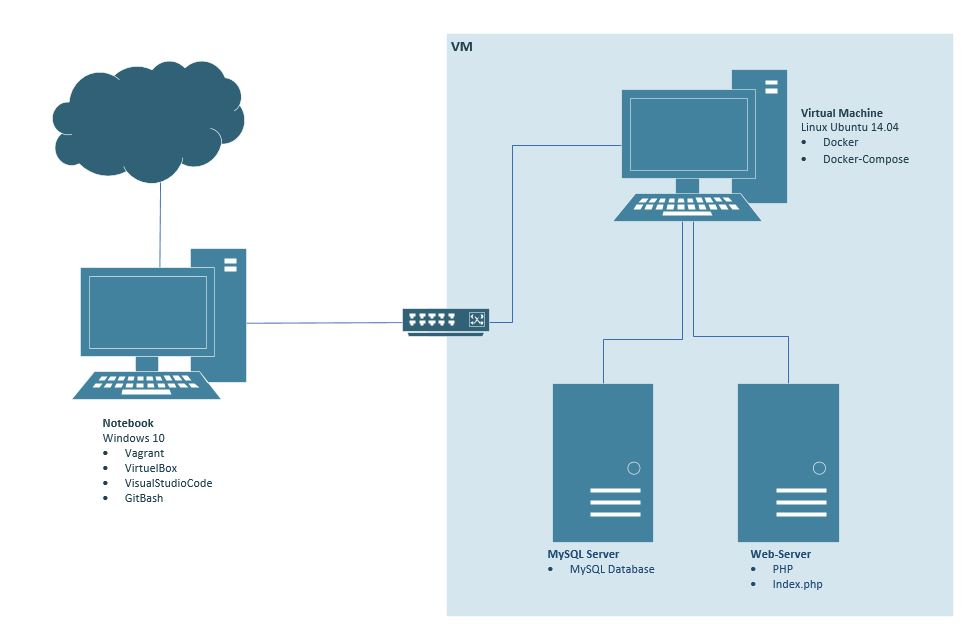

# Dokumentation LB3 - Webformular
| Autor         | Raveendran Shajiran                                          |
|:--------------|:-------------------------------------------------------------|
| Erstell Datum | 16. April 2021                                               |
| Klasse        | ST18e                                                        |
| Modul         | 300 / Plattformübergreifende Dienste im Netzwerk integrieren | 
| Lehrperson    | Berger Marco                                                 |


## Inhaltsverzeichnis
- [Einleitung](#einleitung)
    - [Service](#service)
- [Umsetzung](#umsetzung)
    - [Tools](#tools)
    - [Netzplan](#netzplan)
    - [Image](#image)
        - [PHP](#php)  
        - [MySQL](#mysql)
    - [Docker-Compose](#dockercompose)
        - [Service Konfiguration](#servicekonfiguration)
        - [Web Service Konfiguration](#webkonfiguration)
        - [MySQL Service Konfiguration](#mysqlkonfiguration)
    - [Dockerfile](#dockerfile)
    - [Index.php](#index)
- [Testen](#testen)
- [Quellenverzeichnis](#quellenverzeichnis)
-----------------

<a name="einleitung"></a>
## Einleitung
In diesem Projekt befassen wir uns mit **Docker**. **Docker** ist eine Freie Software zur Isolierung von Anwendungen mit Hilfe von Containervirtualisierung. Docker vereinfacht die Bereitstellung von Anwendungen, weil sich Container, die alle nötigen Pakete enthalten, leicht als Dateien transportieren und installieren lassen. 

<a name="service"></a>
### Service
Mittels **PHP-Apache** werden wir nun eine Webumgebung einrichten. Anschliessend richten wir mittles **MySQL** einen Datenbank ein. Zum Schluss wollen wir diese nun zusammenführen. Wir erstellen danach also einen Webformular, in der dann Daten eingetragen werden können und diese Daten werden anschliessend in der Datenbank von MySQL gespeichert. 

<a name="umsetzung"></a>
## Umsetzung
<a name="tools"></a>
### Tools
Bevor wir dem Code zuwenden, benötigen wir folgende Tools:
- VirtualBox
- Vagrant
- Docker
- Docker-Compose
- VisualStudioCode
- GitBash

<a name="netzplan"></a>
### Netzplan
Um eine bessere Übersicht zum Projekt zu erhalten, erstellte ich hier ein Netzplan:


<a name="image"></a>
### Image
Wie man auf dem Plan sieht, haben wir zwei Server in unserer Umgebung. Das bedeutet, wir verwenden ebenfalls zwei Images, wobei eines davon wir selber erstellen werden. Die Images werden von der [Docker-Hub](https://hub.docker.com/search?q=&type=image) Seite entwendet.

<a name="php"></a>
#### PHP
Für den Webserver verwenden wir folgenden Image: [php:7.3.3](https://hub.docker.com/r/djenko/httpd-php-ext). **PHP** ist eine serverseitige Scriptsprache, die für Webentwicklungen entwickelt wurde, kann aber auch für allgemeine Zwecke eingesetzt werden. Für unser Projekt perfekt geeignet. 

<a name="mysql"></a>
#### MySQL
Für den MySQL Server verwenden wir folgenden Image: [mysql:8.0](https://hub.docker.com/_/mysql). **MySQL** ist ein weit verbreitets Datenbankmanagementsystem und somit die beliebteste Open-Source-Datenbank der Welt. Mit seiner bewährten Leistungsfähigkeit, Zuverlässigkeit und Benutzerfreundlichkeit hat sich MySQL zur führenden Datenbank für webbasierte Anwendungen entwickelt, die das gesamte Spektrum von persönlichen Projekten und Webseiten abdecken.

<a name="dockercompose"></a>
### Docker-Compose
Nun müssen wir die Images in unsere Umgebung einbauen. Dazu verwenden wir Docker-Compose. Docker-Compose ist ein Tool, das zum Definieren und Freigeben von Containeranwendungen entwickelt wurde. Wir erstellen ein YAML-Datei für das Docker-Compose, um die Dienste zu definieren, die wir mit einem einzigen Befehl starten bzw. beenden können. Den [ganzen Code](https://github.com/shajiran/m300_lb/blob/main/lb3/docker-compose.yml) findet man im Repository. Wir werden hier nun die einzelnen Schritte genauer anschauen.

<a name="servicekonfiguration"></a>
#### Service Konfiguration
Wir bestimmen zuerst die Version des Docker-Compose Files "3.3". Anschliessend bestimmen wir mittels "services: " die Services, die wir benutzen wollen. Dabei können wir frei wählen, wie wir die Services benennen. In unserem Fall nennen wir diese "web: " und "mysql: ". 
```
version: '3.3'
services:
  web:
    ...
    ...
    ...
    
  mysql:
    ...
    ...
    ...
```

<a name="webkonfiguration"></a>
#### Web Service Konfiguration
##### Build
Im "build: " können wir nun den Service Aufbau definieren. Build kann entweder als String angegeben werden, der einen Pfad direkt zum Build-Kontext enthält, oder als Objekt mit dem unter "context: " angegebenen Pfad und optional "dockerfile: " angegeben werden. Hier kreieren wir also einen eigenen Image. 
```
    build: 
      context: ./php
      dockerfile: dockerfile
```

##### Container Name
Mittels "container_name: " können wir dem Container einen eigenen Namen vergeben.
```
    container_name: php
```

##### Depends on
Mittels "depends_on: " können wir die Abhängigkeit zwischen weitere Dienste / Services ausdrücken. Dies Bedeutet, dass es Dienste / Services in der Reihenfolge ihrer Abhängigkeit startet. Im folgenden Codezeile wird also "mysql" vor "web" gestartet.
```
    depends_on:
      - mysql
```

##### Volumes
Hier binden wir einen "volume: " ein, die als Unteroption für PHP angegeben ist. 
```
    volumes:
      - ./php:/var/www/html/
```

##### Ports
Damit wir auch auf unsere Webseite gelangen können, leiten wir den Port 80 auf 8000 um. 
```
    ports:
      - 8000:80
```

<a name="mysqlkonfiguration"></a>
#### MySQL Service Konfiguration
##### Build
Nun beim zweiten Service sieht der Aufbau ähnlich. Wir bestimmen wieder einen Namen für den Container, holen diesmal aber ein Image direkt aus Docker-Hub, anstatt ein eigenes zu erzeugen. 
```
    container_name: mysql
    image: mysql:8.0
```

##### Command
Wenn man MySQL lokal ausführt, kann man als Nächstes die Datei "my.cnf" ändern, indem man die unten gebildete Zeile hinzufügt und den MySQL-Dienst neu startet. Dadurch werden alle Datenbankbenutzer (einschliesslich root) mit der Authentifizierung "mysql_native_password" validiert. Mittels "restart: " funktion kann man den Container steuern, ob der automatisch startet, wenn man z.B. denn Docker neu startet. Wenn bei restart "always" angegeben ist, startet der Container immer neu.
```
    command: --default-authentication-plugin=mysql_native_password
    restart: always
```

##### Enviroment
Mittels "environment: " können wir einige Voreinstellungen nehmen. Wir setzen für den "Root" User im Service ein Passwort, benennen unser Datenbank und setzen einen User mit einem Passwort.
```
    environment: 
      MYSQL_ROOT_PASSWORD: root
      MYSQL_DATABASE: Raveendran_db
      MYSQL_USER: Raveendran
      MYSQL_PASSWORD: Raveendran123
```

##### Ports
Auch hier leiten wir den Port 3306 auf 6033 um. 
```
    ports: 
      - 6033:3306
```

<a name="dockerfile"></a>
### Dockerfile
Wie schon vorhin erwähnt erstellen wir für den Web Serveice einen eigenen Image, die zusätzlich noch eine MySQL Support anbietet. Dafür erstellen wir einen Dockerfile.
```
    FROM php:7.3.3-apache
    RUN apt-get update && apt-get upgrade -y
    RUN docker-php-ext-install mysqli
    EXPOSE 80
```

<a name="index"></a>
### Index.php
Nun erstellen wir ein "index.php" Datei, ist ähnlich wie die "index.html" Datei. Wir möchten herausfinden, ob unsere MySQL sich verbinden lässt. Auf der Webseite sollte angezeigt werden ob es fehlgeschlagen hat oder ob eine Verbindung hergestellt wurde.
```
<?php
    $host = 'mysql';
    $user = 'Raveendran';
    $password = 'Raveendran123';
    $db = 'Raveendran_db';

    $connection = new mysqli($host,$user,$password,$db);
    if($connection->connect_error){
        echo 'Connection FAILED' . $connection->connect_error;
    }
    echo 'Raveendran Shajiran MYSQL: Connected';
?>
```

<a name="quellenangaben"></a>
## Quellenverzeichnis
- [Docker-Compose](https://docs.docker.com/compose/)
- [Docker-Compose Versionen](https://docs.docker.com/compose/compose-file/compose-versioning/)
- [Docker-Compose Build](https://docs.docker.com/compose/compose-file/compose-file-v3/#context)
